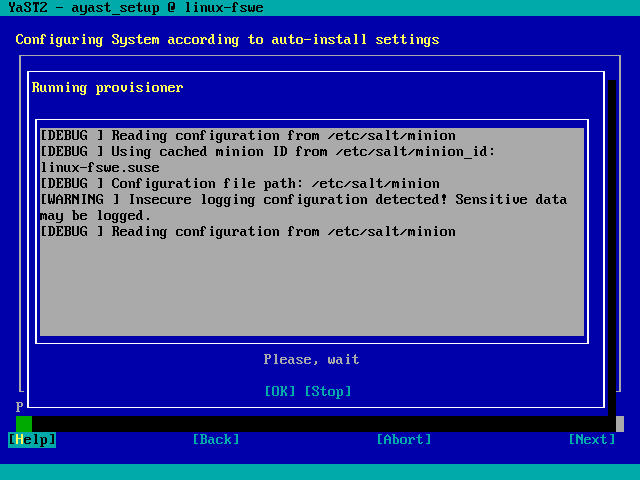

# YaST CM

This module allows AutoYaST2 to delegate part of the configuration to a
[Software Configuration Management](https://en.wikipedia.org/wiki/Software_configuration_management)
system. Salt and Puppet are supported.

At this time, the module is only a simple proof of concept and is not
ready for prime time.



## How it works

The module will take care of:

* Installing needed packages.
* Retrieving authentication keys.
* Updating configuration if needed.
* Applying configuration during AutoYaST 2nd stage.

## Example

### Client/master

```xml
<cm>
  <type>salt</type> <!-- you can use "puppet" -->
  <master>my-salt-server.example.net</master>
  <attempts config:type="integer">5</attempts>
  <timeout config:type="integer">10</timeout>
  <keys_url>usb:/</keys_url> <!-- you can use HTTP, FTP... -->
</cm>
```

### Masterless mode

```xml
<cm>
  <type>salt</type> <!-- you can use "puppet" -->
  <config_url>http://myserver.example.net/states.tgz</config_url>
  <attempts config:type="integer">3</attempts>
</cm>
```

## Supported systems

### Salt

In this case, `salt-minion` package will be installed. If a `master`
is set in the AutoYaST profile, `/etc/salt/minion` will be
updated. Finally, `salt-call` will be used to apply the configuration.

### Puppet

In this case, `puppet` package will be installed. If a `master`
is set in the AutoYaST profile, `/etc/puppet/puppet.conf` will be
updated. Finally, `puppet agent` will be used to apply the configuration.

## Advanced options

To set up advanced options you can use the
[AutoYaST file element](https://www.suse.com/documentation/sles-12/singlehtml/book_autoyast/book_autoyast.html#createprofile.completeconf).
